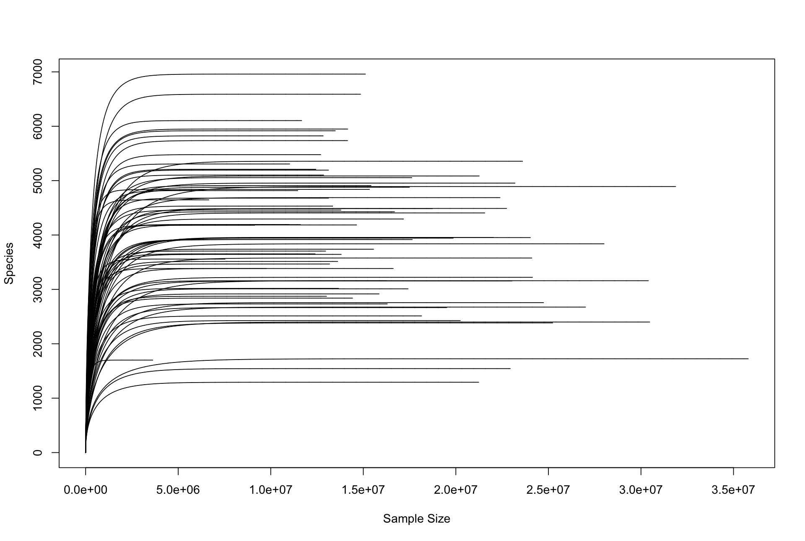
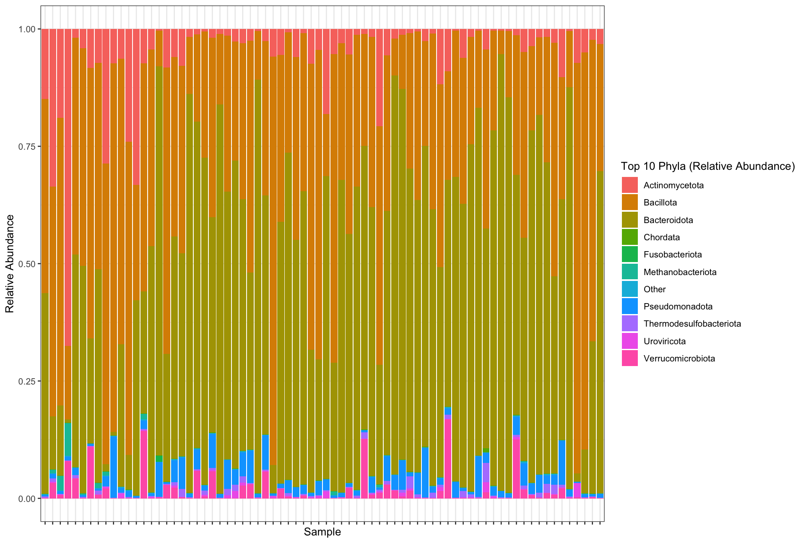
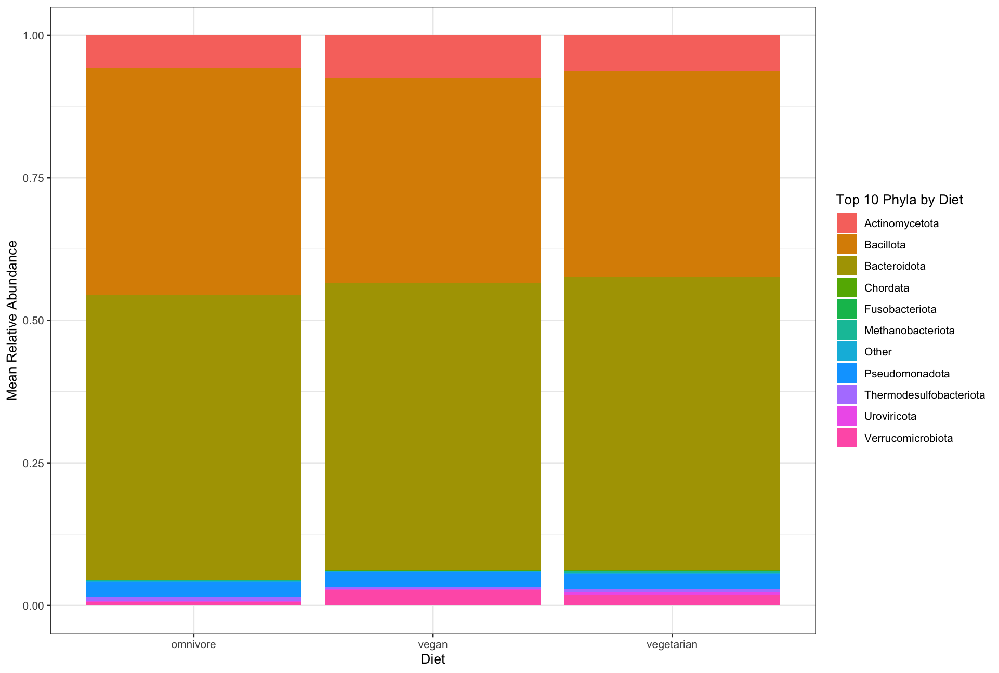
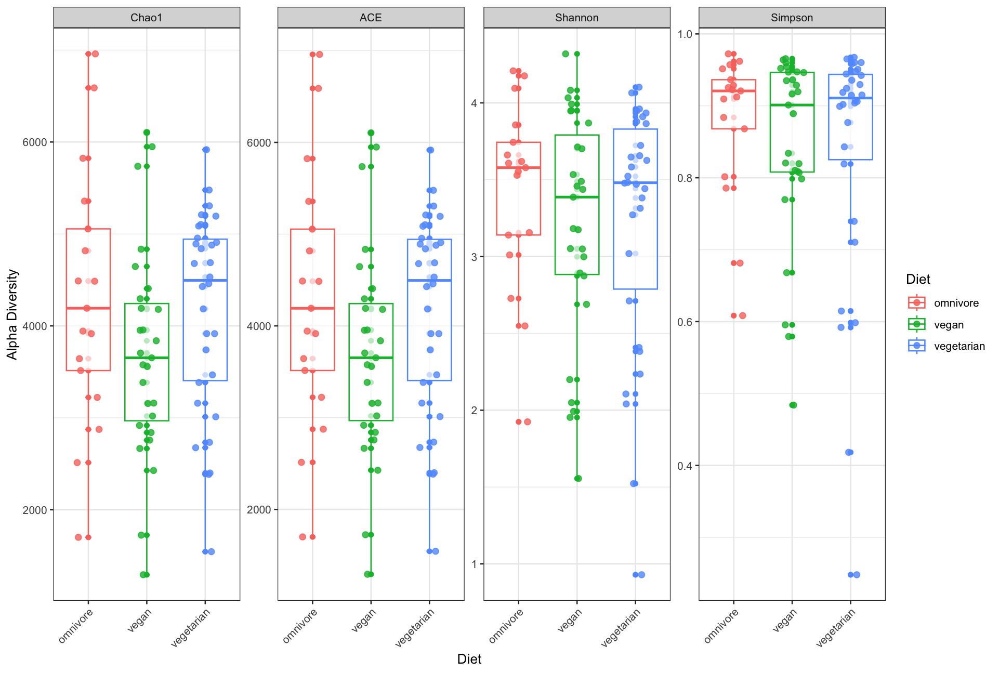
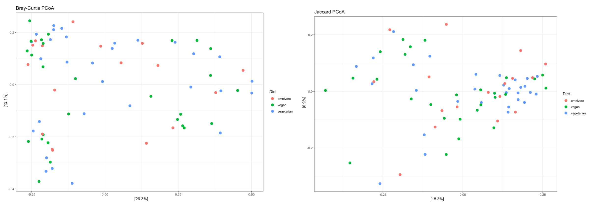
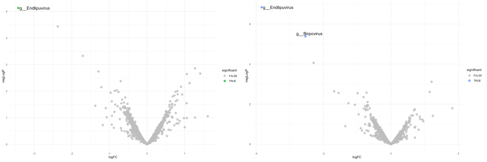

# BINF6110 Assignment 3: Using Bioinformatic Research Tools to Conduct Taxonomic Profiling of the Human Gut Microbiome Using Shotgun Metagenomics
## Introduction

The human gut microbiome is comprised of diverse communities of microorganisms, including bacteria, archaea, protozoa, and fungi, that together form a complex and dynamic ecosystem. [1] These microbial communities play essential roles in host immune responses, metabolic function, nutrient dynamics, gut physiology, and the prevention and management of disease. [2] Gut microbiome organization, heterogeneity and function are strongly influenced by diet. [3] Investigating the effects of dietary variation on the microbiome is critical for guiding evidence-based nutritional decisions that enhance metabolic and intestinal health and mitigate the development of diet-related diseases. [3]  The advent of whole-genome shotgun (WGS) sequencing technologies has facilitated high-throughput metagenomic analysis of gut microbiota. [4] WGS enables effective characterization of community structures, phylogenetic diversity, intraspecies variation, functional pathway profiling, and near-complete genome reconstruction. [4] Here, we present a computational framework for shotgun metagenomic analysis of gut microbiome samples from healthy Italian adults, used to investigate how habitual diet shapes microbial abundance, diversity, and composition.

Well-founded metagenomic analysis relies on accurate assignment of taxonomic labels to sequencing reads. [5] Kraken and its optimized pipeline, Kraken2, use k-mer-based classification strategies to map genomic sequences with the lowest common ancestor taxa. [5] Kraken2 overcomes the memory-intensive limitations of Kraken by leveraging intermediate probabilistic hash tables to expedite taxonomic classification without necessitating significant RAM requirements. [5] Compared with other classification tools, including Centrifuge, CLARK, Kraken1, KrakenUniq, and Kaiju, Kraken2 achieves comparable or superior accuracy and genus-level agreement metrics while offering significantly faster processing speeds [5]. However, because Kraken2 reports classifications at the lowest common ancestor (LCA), reads from highly populated taxonomic clades with low genomic diversity are often assigned to higher taxonomic levels (e.g., genus or family), leading to underestimation of true species-level abundance. [6] To improve estimation of species- and strain-level abundance, Lu et al. (2025) developed Bracken (Bayesian Reestimation of Abundance after Classification with KrakEN), which uses a probabilistic framework to redistribute reads based on their taxonomic assignments [6]. By reassigning reads classified by Kraken, Bracken generates more accurate species-level abundance estimates with minimal false positives. [6] 

Following the estimation of species-level abundances, microbiome analyses assess differences in microbial composition within and between samples using comparative metrics known as alpha and beta diversity. [7] Alpha diversity characterizes within-sample community complexity through measures of richness, evenness (or dominance), phylogenetic diversity, and information-based indices, collectively reflecting the diversity and distribution of taxa [8]. In contrast, beta diversity quantifies differences in microbial composition across microbiomes, with metrics like Bray-Curtis dissimilarity and the Jaccard index capturing variation in taxa abundance and presence/absence [8]. *Phyloseq* is an R-based software package for microbiome representation and analysis, providing an object-oriented framework for the efficient organization, management, and preprocessing of phylogenetic sequencing data, thereby facilitating downstream microbiome analyses. [9] The phyloseq estimate_richness() function supports various alpha diversity metrics, while the distance() and ordinate() functions can be used to compute and evaluate pairwise sample distances for beta diversity analysis. [9] *Phyloseq* also integrates with R packages including vegan, DESeq2, and ggplot2, offering a unified and reproducible framework for microbiome data analysis, and representing one of the few Bioconductor tools that supports phylogenetic trees and taxonomic clustering outputs [9].

Identifying differentially abundant taxa across microbiome samples can reveal microbial patterns associated with habitual diet, and their potential links to human health and gut physiology. Differential abundance analysis of microbiome data faces unique challenges, namely that metagenomic count data often contains a significant portion of zeros, and that microbiome datasets are compositional, meaning they do not represent absolute abundances of microbes, but rather their relative proportions within a sample. [10, 11] ANCOM-BC (Analysis of Compositions of Microbiomes with Bias Correction) is a statistical method designed to estimate absolute taxon abundances by accounting for unknown sampling fractions and correcting biases across samples. Compared with other differential abundance approaches, ANCOM-BC demonstrates strong control of false discovery rates, provides taxon-specific p-values and confidence intervals, and is well-suited for analyses with moderate to large sample sizes (n > 10). [10] 

This study evaluates a computational pipeline for the analysis of shotgun metagenomic gut microbiome samples to taxonomically classify and compare microbial diversity, abundance, and variation between individuals with differing habitual diets. 

## Methods 

### Sequencing Data Acquisition 

Metagenomic analysis was conducted on publicly available gut microbiome samples from 74 healthy Italian adults generated by the University of Naples Federico II (BioProject: PRJNA421881; SRA study: SRP126540), and sequencing was performed using the Illumina NextSeq 500 platform. Raw SRR accession files were retrieved from the NCBI Sequence Read Archive using the SRA Toolkit and converted to FASTQ format. Sequencing quality was assessed for each sample using FastQC, which reports metrics of per-base sequence quality, GC content, sequence duplication levels, and adapter contamination. FastQC outputs were aggregated using MultiQC (BioConda), facilitating the interpretation and visualization of overall sample quality. [12]

### Taxonomic Classification and Species-Level Abundance Estimation

Assignment of taxonomic labels to sequencing reads was performed using Kraken2 in conjunction with the standard Kraken2/Bracken RefSeq database. Paired-end FASTQ files for each sample were processed to generate both classification output files, which record read-level taxonomic assignments, and report files summarizing taxonomic abundance across hierarchical levels. [5] A confidence threshold of 0.15 was applied to balance classification sensitivity and accuracy. The --quick flag was enabled to improve computational efficiency by terminating k-mer searches after the first database match, thereby reducing runtime across all 74 samples. 

The resulting Kraken2 report files were subsequently processed using Bracken to refine species-level abundance estimates. Bracken was run using the same reference database, with parameters -l S to specify species-level classification and -r 150 to match the read length of the sequencing data. The 74 species-level report files generated by Bracken were then converted into a BIOM-format table using kraken-biom, facilitating downstream diversity and compositional analyses. 

For downstream metagenomic analysis, the BIOM-format file was imported into R using the biomformat package and converted into a *phyloseq* object using the import_biom() function. The resulting *phyloseq* object was then integrated with sample metadata, enabling the analysis of taxonomic abundance patterns stratified by diet. Rarefaction curves were generated to assess whether sequencing depth was sufficient to capture species richness. To evaluate overall taxonomic composition, sample counts were transformed to relative abundances with the transform_sample_counts() function, and the ten most abundant phyla were visualized. Samples were subsequently grouped by diet to compare relative phylum-level abundance across habitual diets.

### Alpha and Beta Diversity Analysis 

Alpha diversity metrics were selected to comprehensively capture microbial richness, diversity, entropy, and community dominance [13]. Species richness and diversity were quantified using the Chao1, ACE, Shannon, and Simpson indices, calculated from the *Phyloseq* object using the estimate_richness() function. Dominance was assessed using the Berger-Parker index (DBP), computed with the *microbiome* R package. Mean values for each alpha diversity metric were calculated across dietary groups. Phylogenetic diversity metrics were not calculated due to the absence of sequence-based phylogenetic information in the Kraken2/Bracken-derived dataset. External reference trees were not incorporated to avoid potential mismatches and the introduction of associated biases.

Beta diversity was assessed in R using the *Phyloseq* package to evaluate differences in microbial composition across habitual diets. To reduce noise from rare taxa, features with a total abundance ≤10 across all samples were removed before analysis. Community dissimilarity was quantified using both Bray-Curtis and Jaccard distance metrics. Bray-Curtis distances were calculated from abundance data to capture differences in taxon relative abundances, whereas Jaccard distances were computed from presence-absence transformed data to assess differences in community membership. Principal coordinates analysis (PCoA) was performed on each distance matrix, and ordinations were visualized with samples coloured by diet group. Statistical significance of differences in microbial community composition across dietary groups was evaluated using permutational multivariate analysis of variance (PERMANOVA), implemented in R using the adonis2() function. Separate PERMANOVA tests were conducted for Bray-Curtis and Jaccard distance matrices.

### Differential Abundance Analysis

Differential abundance analysis was performed to identify taxa associated with habitual diet using ANCOM-BC2 (Analysis of Compositions of Microbiomes with Bias Correction), which accounts for the compositional structure of microbiome datasets and corrects for biases in sequencing data while controlling false discovery rates [10]. Analyses were conducted in R using the *ANCOMBC* package on the phyloseq object. Although abundance estimates were initially generated at the species level, taxa were aggregated at the genus level (Rank6) for differential analysis to improve robustness and reduce sparsity. The model included diet as a fixed effect (fix_formula = "Diet"), and no random effects were specified. Multiple testing correction was applied using the Holm method to attempt to tightly control against false positives common in DA methods. [14] Structural zeros were identified and incorporated into the model, and sensitivity analysis with pseudo-count addition was enabled. Low-prevalence and low-depth features were filtered using a prevalence cutoff of 0.1 and a library size cutoff of 1000 reads. Additional parameters included s0_perc = 0.05 to stabilize variance estimates and neg_lb = TRUE to ensure conservative inference based on lower-bound estimates. Differentially abundant taxa were identified for each dietary contrast by filtering results for Holm-adjusted p-values < 0.05.

## Results 

### Sequencing Data Quality and Characteristics

Analysis of publicly available gut microbiome samples from 74 healthy Italian adults, sequenced using an Illumina NextSeq 500, yielded 74 paired-end datasets totalling 304.14 Gb of data. Across all samples, FastQC analysis indicated a mean sequencing depth of 34.65 million reads per sample, with an average read length of 149.35 base pairs and a mean GC content of 50.15%. Per-base sequence quality was consistently high, with mean Phred scores ≥ 27.11 across all positions, and no detectable adapter contamination was observed. Expected Illumina WGS-specific biases were observed in analysis results, including elevated per-base sequence content and per-sequence GC content, consistent with Illumina library prep coverage biases. [15]

### Global Taxonomic Abundance and Diet-Specific Taxa 

Rarefaction curves approached asymptotic plateaus across all samples, suggesting that sequencing depth was sufficient to capture the majority of species richness. (Figure 1) 

  

  <small>
    <b>Figure 1. Rarefaction Curves. </b> The Vegan package function rarecurve() was used to produce a rarefaction curve (black) for each of the 74 samples. All sample curves approached asymptotic plateaus, indicating that sequencing depth was sufficient to capture the majority of species richness. 
  </small>

Taxonomic profiles across all samples revealed that the gut microbiome was predominantly composed of ten major phyla, including *Actinomycota*, *Bacillota*, *Bacteroidota*, *Chordata*, *Fusobacteriota*, *Methanobacteriota*, *Pseudomonadota*, *Thermodesulfobacteriota*, *Uroviricota*, and *Verrucomicrobiota*. Across all samples, *Bacteroidota* and *Bacillota* were the most abundant phyla, collectively accounting for the majority of the microbial community (Figure 2). Considerable inter-individual variability was observed in the relative proportions of these dominant taxa, while lower-abundance phyla were present at consistently smaller levels.

  

  <small>
    <b>Figure 2. Relative Abundance of the Ten Most Abundant Phyla Across Samples. </b> Sample counts were transformed to relative abundances with the transform_sample_counts() function, and the ten most abundant phyla were visualized. Phyla are coloured according to the legend on the right. <i>Actinomycota</i>, <i>Bacillota</i>, <i>Bacteroidota</i>, <i>Chordata</i>, <i>Fusobacteriota</i>, <i>Methanobacteriota</i>, <i>Pseudomonadota</i>, <i>Thermodesulphobacteriota</i>, <i>Uroviricoda</i>, and <i>Verrucomicrobiota</i> are the 10 most abundant phyla, with <i>Bacteroidota</i> and <i>Bacillota</i> dominating relative abundances across samples. 
  </small>

When stratified by diet, *Bacteroidota* and *Bacillota* remained the predominant phyla across all dietary groups (Figure 3). Mean relative abundance profiles indicated that individuals with an omnivorous habitual diet exhibited lower proportions of *Actinomycota*, *Pseudomonadota*, and *Verrucomicrobiota* compared to both vegan and vegetarian groups. The relative contributions of minor phyla remained low and broadly consistent across diets.

  

  <small>
    <b>Figure 3. Mean Relative Abundance of the Ten Most Abundant Phyla by Diet. </b> Sample counts were transformed to relative abundances with the transform_sample_counts() function, stratified by diet using sample metadata, and the ten most abundant phyla were visualized. Phyla are coloured according to the legend on the right. <i>Actinomycota</i>, <i>Bacillota</i>, <i>Bacteroidota</i>, <i>Chordata</i>, <i>Fusobacteriota</i>, <i>Methanobacteriota</i>, <i>Pseudomonadota</i>, <i>Thermodesulphobacteriota</i>, <i>Uroviricoda</i>, and <i>Verrucomicrobiota</i> are the 10 most abundant phyla, with <i>Bacteroidota</i> and <i>Bacillota</i> dominating relative abundances across diet groups. Mean relative abundance profiles demonstrate omnivorous individuals exhibited lower proportions of <i>Actinomycota</i>, <i>Pseudomonadota</i>, and <i>Verrucomicrobiota</i> compared to both vegan and vegetarian groups.
  </small>

### Microbial Diversity and Composition

Alpha diversity metrics were used to assess within-sample richness and diversity across dietary groups (Figure 4). Richness estimates, as measured by Chao1 and ACE, were comparable across diets, with omnivores exhibiting the highest mean richness (Chao1 mean: 4299.6), followed by vegetarians (4168.8) and vegans (3700.9). Substantial variability was observed within each group, with overlapping distributions across all diets. (Figure 4) Diversity metrics incorporating both richness and evenness (Shannon and Simpson Information indices) showed similar patterns. Omnivorous samples exhibited the highest mean Shannon diversity (3.42), while vegan (3.21) and vegetarian (3.22) groups showed slightly lower values. Simpson diversity followed a similar trend, with omnivores displaying the highest mean (0.878), compared to vegans (0.847) and vegetarians (0.837). Dominance, assessed using the Berger-Parker index, was slightly higher in vegan and vegetarian groups (0.30 and 0.30, respectively) compared to omnivores (0.27), indicating moderately lower taxonomic diversity in these groups. Overall, while minor differences in alpha diversity were observed between dietary groups, substantial overlap in distributions suggests that within-sample diversity is broadly comparable across diets, with vegans exhibiting slightly lower species richness on average.

  

  <small>
    <b>Figure 4. Alpha Diverity Measures Across Diets. </b> The Phyloseq package plot_richness() function was used to generate plots for Chao1, ACE, Shannon and Simpson alpha diversity measures across diet groups. Boxplots are used to demonstrate the distribution of alpha diversity measures for the samples in each dietary group, with average measures indicated by the bold horizontal lines. Samples are coloured by diet: omnivores in red, vegans in green, and vegetarians in blue. Minor differences in alpha diversity are exhibited between dietary groups; substantial distribution overlaps suggest that within-sample diversity is broadly comparable across diets. 
  </small>

Beta diversity analysis using Bray-Curtis and Jaccard distance metrics revealed no significant differences in microbial community composition between dietary groups. Principal coordinates analysis (PCoA) showed no clear clustering by diet (Figure 5). PERMANOVA results indicated that diet explained only a small proportion of the observed variation (Bray-Curtis: $R^2$ = 0.022, p = 0.743; Jaccard: $R^2$ = 0.028, p = 0.305). Together, these results indicate that neither taxonomic composition nor community membership differed substantially across dietary groups.

  

  <small>
    <b>Figure 5. Beta Diversity Principal coordinates analysis. </b> Principal coordinates analysis of ordinated Bray-Curtis and Jaccard distance matrices. Samples are coloured by diet: omnivores in red, vegans in green, and vegetarians in blue. Results show no clear clustering by diet, indicating no significant differences in microbial community composition between dietary groups
  </small>

### Dietary Differential Microbial Abundance 

Genus-level differential abundance analysis using ANCOM-BC2, with diet modelled as a fixed effect and Holm correction applied, identified a limited number of significant associations. Endlipuvirus was differentially abundant between omnivorous and vegan groups (LFC = -3.42, q = 0.0155), while both Endlipuvirus and Birpovirus differed between omnivorous and vegetarian groups (LFC = -3.83, q = 0.0003 and LFC = -2.54, q = 0.0009). (Figure 8)

  

  <small>
    <b>Figure 6. Beta Diversity Principal coordinates analysis. </b> Differential abundance was assessed using ANCOM-BC2 with diet modelled as a fixed effect and Holm-adjusted p-values. The left panel shows vegans compared to omnivores, while the right panel shows vegetarians compared to omnivores. The x-axis represents log₂ fold change, and the y-axis represents −log₁₀(p-value). Genera are coloured according to significance (q ≤ 0.05), with significant taxa shown in green (vegan comparison) or blue (vegetarian comparison), and non-significant taxa in gray. <i>Endlipuvirus</i> was the only genus differentially abundant between omnivorous and vegan groups, while both <i>Endlipuvirus</i> and <i>Birpovirus</i> were differentially abundant between omnivorous and vegetarian groups.
    </small>

## Discussion

Diet is a major determinant of gut microbiome composition, diversity, and function [3]. Understanding how dietary variation shapes the microbiome is essential for informing evidence-based nutritional strategies that support metabolic and gut health and reduce the risk of diet-related diseases [3]. In this study, analysis of shotgun metagenomic gut microbiome samples from healthy Italian adults with varying habitual diets reveals that diet choice (omnivore, vegan or vegetarian) has little to no effect on microbial species diversity, richness, taxonomic and/or community composition. A limited number of viral genera demonstrate significant associations with diet; the genus *Endlipuvirus* exhibits statistically significant differential abundance in omnivores compared to vegans and vegetarians (LFC = - 3.42 and -3.83), and the genus *Birpovirus* in omnivores compared to vegetarians (LFC = -2.54). 

The genus *Endlipuvirus*, within the bacteriophage family *Intestiviridae*, has been identified in the human gut microbiome through isolation from fecal samples [16,17]. Genomic analyses indicate that these phages exhibit host-specific adaptations to distinct bacterial lineages in gut ecosystems [16]. As members of the ‘crAss-like’ phage group, *Endlipuvirus* are thought to regulate *Bacteroidota* populations, essential mutualistic bacteria involved in immunomodulation, pathogen infection defence, and vitamin biosynthesis. [18] Previous studies have noted *Endlipuvirus* abundance may be underestimated due to GC-content bias in sequencing [19]; the observed association with an omnivorous diet is therefore likely to reflect genuine differences in host bacterial community dynamics. *Birpoviruses*, members of the *Suoliviridae family*, have also been identified in the human gut microbiome and classified as ‘crAss-like’ phages. They are therefore likely involved in shaping bacterial host composition and function, although the mechanisms underlying these interactions remain unclear [20]. 

Numerous studies have examined how diet shapes the human gut microbiota. The Western diet has been associated with reduced microbial diversity, pronounced compositional shifts, and an increased abundance of dysbiotic and potentially pathogenic taxa [21,22]. In contrast, a Slovenian study reported higher *Bacteroides* abundance and lower *Clostridium* cluster abundance in vegetarians compared to omnivores [23]. Other dietary patterns, including Mediterranean, gluten-free, and low-FODMAP diets, have also been investigated for their effects on the microbiome [22]. Here, we present a within and between-group comparison of three habitual dietary patterns. Understanding how vegan and vegetarian diets influence the gut microbiome is increasingly important as plant-based diets continue to gain popularity [24].

While this study provides a concrete analysis of gut microbiome composition, diversity, and function across dietary groups, several limitations related to technological biases and statistical power should be considered. As noted previously, Illumina whole-genome sequencing (WGS) is subject to library preparation and coverage biases, particularly with respect to GC content, which may result in the underrepresentation of certain taxa [15,19]. Alpha diversity estimates were derived from species-level abundance data; however, because low-abundance taxa were excluded from the bracken_species.report to reduce potential false positives, richness estimates are likely conservative. Additionally, differential abundance analysis using ANCOM-BC2 was conducted at the genus level (Rank 6), and therefore, identified associations are limited to genus-level resolution.

Future studies should increase the sample size within each dietary group to improve statistical power and the robustness of observed patterns. Correction for GC-content bias could be implemented using tools like Illumina’s DRAGEN GC Bias Correction, which adjusts sequencing coverage based on GC percentage. Furthermore, performing differential abundance analyses across multiple taxonomic levels using ANCOM-BC2 would provide a more comprehensive understanding of diet-associated taxa across phylogenetic ranks. Despite these limitations, this study provides a strong foundation for understanding how habitual dietary patterns influence the human gut microbiota.

## References 

1. Walker, A.W., Hoyles, L. Human microbiome myths and misconceptions. Nat Microbiol 8, 1392–1396 (2023). https://doi.org/10.1038/s41564-023-01426-7
2. Bull, M. J., & Plummer, N. T. (2014). Part 1: The Human Gut Microbiome in Health and Disease. Integrative medicine (Encinitas, Calif.), 13(6), 17–22.
3. Ross, F.C., Patangia, D., Grimaud, G. et al. The interplay between diet and the gut microbiome: implications for health and disease. Nat Rev Microbiol 22, 671–686 (2024). https://doi.org/10.1038/s41579-024-01068-4
4. ​​Chen K, Pachter L (2005) Bioinformatics for Whole-Genome Shotgun Sequencing of Microbial Communities. PLOS Computational Biology 1(2): e24. https://doi.org/10.1371/journal.pcbi.0010024
5. Wood, D. E., Lu, J., & Langmead, B. (2019). Improved metagenomic analysis with Kraken 2. Genome biology, 20(1), 257. https://doi.org/10.1186/s13059-019-1891-0
6. Lu, J., Breitwieser, F. P., Thielen, P., & Salzberg, S. L. (2017). Bracken: estimating species abundance in metagenomics data. PeerJ. Computer science, 3, e104. https://doi.org/10.7717/peerj-cs.104
7. Kers JG and Saccenti E (2022) The Power of Microbiome Studies: Some Considerations on Which Alpha and Beta Metrics to Use and How to Report Results. Front. Microbiol. 12:796025. doi: 10.3389/fmicb.2021.796025
8. Cassol, I., Ibañez, M. & Bustamante, J.P. Key features and guidelines for the application of microbial alpha diversity metrics. Sci Rep 15, 622 (2025). https://doi.org/10.1038/s41598-024-77864-y
9. McMurdie, P. J., & Holmes, S. (2013). phyloseq: an R package for reproducible interactive analysis and graphics of microbiome census data. PloS one, 8(4), e61217. https://doi.org/10.1371/journal.pone.0061217
10. Lin, H., Peddada, S.D. Analysis of compositions of microbiomes with bias correction. Nat Commun 11, 3514 (2020). https://doi.org/10.1038/s41467-020-17041-7
11. Gloor, G. B., Macklaim, J. M., Pawlowsky-Glahn, V., & Egozcue, J. J. (2017). Microbiome Datasets Are Compositional: And This Is Not Optional. Frontiers in microbiology, 8, 2224. https://doi.org/10.3389/fmicb.2017.02224
12. Ewels, P., Magnusson, M., Lundin, S., & Käller, M. (2016). MultiQC: summarize analysis results for multiple tools and samples in a single report. Bioinformatics (Oxford, England), 32(19), 3047–3048. https://doi.org/10.1093/bioinformatics/btw354
13. Cassol, I., Ibañez, M. & Bustamante, J.P. Key features and guidelines for the application of microbial alpha diversity metrics. Sci Rep 15, 622 (2025). https://doi.org/10.1038/s41598-024-77864-y
14. Lin, H., Peddada, S.D. Multigroup analysis of compositions of microbiomes with covariate adjustments and repeated measures. Nat Methods 21, 83–91 (2024). https://doi.org/10.1038/s41592-023-02092-7
15. Process, V., Ambavaram, M. M. R., Vasantgadkar, S., Khanal, S., Werner, M., Berkeley, M. A., Herbert, Z. T., Endress, G., Thomann, U., & Daviso, E. (2025). Optimization of DNA Fragmentation Techniques to Maximize Coverage Uniformity of Clinically Relevant Genes Using Whole Genome Sequencing. Diagnostics (Basel, Switzerland), 15(18), 2294. https://doi.org/10.3390/diagnostics15182294
16. Székely, A. J., Mukhedkar, D., Dillner, J., & Pimenoff, V. N. (2025). Integrated biological and chemical wastewater surveillance reveals local changes in dynamics of human-associated virus, bacteria and chemicals. medRxiv. https://doi.org/10.1101/2025.10.08.25337484 
17. María Dolores Ramos-Barbero, Clara Gómez-Gómez, Gloria Vique, Laura Sala-Comorera, Lorena Rodríguez-Rubio, Maite Muniesa, Recruitment of complete crAss-like phage genomes reveals their presence in chicken viromes, few human-specific phages, and lack of universal detection, The ISME Journal, Volume 18, Issue 1, January 2024, wrae192, https://doi.org/10.1093/ismejo/wrae192
18. Smith, L., Goldobina, E., Govi, B., & Shkoporov, A. N. (2023). Bacteriophages of the Order Crassvirales: What Do We Currently Know about This Keystone Component of the Human Gut Virome?. Biomolecules, 13(4), 584. https://doi.org/10.3390/biom13040584
19. Holcik, L., von Haeseler, A., & Pflug, F. G. (2025). Genomic GC bias correction improves species abundance estimation from metagenomic data. Nature communications, 16(1), 10523. https://doi.org/10.1038/s41467-025-65530-4
20. Vilà-Quintana, L., Fort, E., Pardo, L., Albiol-Quer, M. T., Ortiz, M. R., Capdevila, M., Feliu, A., Bahí, A., Llirós, M., García-Velasco, A., Morell Ginestà, M., Laquente, B., Pozas, D., Moreno, V., Garcia-Gil, L. J., Duell, E. J., Pimenoff, V. N., Carreras-Torres, R., & Aldeguer, X. (2024). Metagenomic Study Reveals Phage-Bacterial Interactome Dynamics in Gut and Oral Microbiota in Pancreatic Diseases. International journal of molecular sciences, 25(20), 10988. https://doi.org/10.3390/ijms252010988
21. Hamilton, M. K., Boudry, G., Lemay, D. G., & Raybould, H. E. (2015). Changes in intestinal barrier function and gut microbiota in high-fat diet-fed rats are dynamic and region dependent. American Journal of Physiology-Gastrointestinal and Liver Physiology, 308(10). https://doi.org/10.1152/ajpgi.00029.2015 
22. Rinninella, E., Tohumcu, E., Raoul, P., Fiorani, M., Cintoni, M., Mele, M. C., Cammarota, G., Gasbarrini, A., & Ianiro, G. (2023). The role of diet in shaping human gut microbiota. Best Practice &amp; Research Clinical Gastroenterology, 62–63, 101828. https://doi.org/10.1016/j.bpg.2023.101828 
23. Matijašić, B.B., Obermajer, T., Lipoglavšek, L. et al. Association of dietary type with fecal microbiota in vegetarians and omnivores in Slovenia. Eur J Nutr 53, 1051–1064 (2014). https://doi.org/10.1007/s00394-013-0607-6
24. Clem, J., & Barthel, B. (2021). A Look at Plant-Based Diets. Missouri medicine, 118(3), 233–238.
